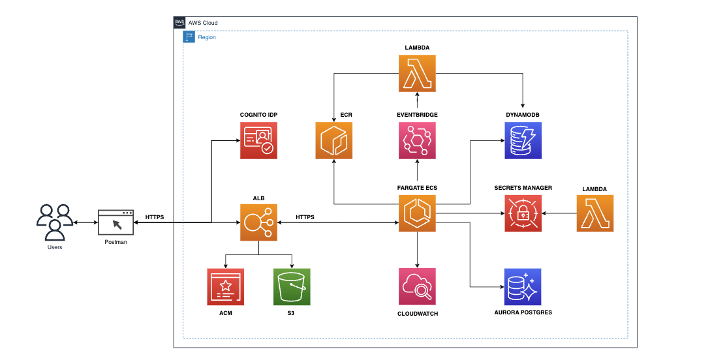

## EDA using Spring Boot and Spring Cloud Functions to deploy native executables on ECS and Lambda respectively.

* **Author**: [Andres Solorzano](https://www.linkedin.com/in/aosolorzano/).
* **Level**: Advanced.
* **Technologies**: Java 17, Spring Boot 3, Spring Cloud 4, Spring Native, Spring WebFlux, Spring OAuth2, Quartz, Flyway, Lombok, Testcontainers, LocalStack, AWS Copilot CLI, AWS SAM-CLI, Amazon Cognito, Amazon Aurora (with PostgreSQL), DynamoDB, Application Load Balancer, EventBridge, Lambda, and Docker.



You can read the following articles from my **Medium.com** account to get more project details:

1. [Multi-Account environment on AWS using IAM Identity Center](https://aosolorzano.medium.com/implementing-a-multi-account-environment-with-aws-organizations-and-the-iam-identity-center-d1cdb40bdf4d).
2. [OAuth2 in Spring Boot Native microservice](https://aosolorzano.medium.com/oauth2-in-spring-boot-native-reactive-microservice-with-amazon-cognito-as-oidc-service-c454d84a5234).
3. [Deploying Spring Boot Native microservice using Cross-Account deployment](https://aosolorzano.medium.com/spring-boot-native-microservice-on-ecs-fargate-using-aws-copilot-cli-for-cross-account-deployment-73b1836f21f7).
4. [End-to-End Encryption using TLS ECDSA certificate and ACM with Copilot CLI](https://aosolorzano.medium.com/end-to-end-encryption-using-tls-ecdsa-certificate-acm-and-aws-copilot-cli-64f5daafe977).
5. [EDA using Amazon EventBridge, Lambda, and SAM-CLI, with Fargate ECS as Event Source](https://aosolorzano.medium.com/eda-with-eventbridge-and-lambda-using-sam-cli-with-spring-boot-ms-on-fargate-ecs-as-event-source-9abee237be08).
6. Storing EDA events in DynamoDB from a Native Lambda Function using GraalVM and Spring Cloud Functions.

### Description.
This project uses Spring Boot to manage Quartz Jobs with the help of Spring Webflux and Spring Native.
The Quartz library is configured for a clustered environment, so it needs Postgres to store and manage Jobs executions.
When a Quartz Job is executed, the calling method retrieves the Device item associated with the Tasks and updates its state in DynamoDB.
To perform all these activities, the users must have a valid access token (JWT) to access the endpoints.
All test cases use TDD from the beginning of the development, and only Integration Tests are executed with the support of Testcontainers and LocalStack to try to cover real-world scenarios.
This project also uses Docker Compose to deploy a local cluster with the required services for local testing.

### Prerequisites.
- Git.
- AWS CLI (version 2.11.+).
- AWS Copilot CLI (version 1.27.+).
- AWS SAM CLI (version 1.90.+).
- OpenJDK (version 17.0.+). You can use SDKMAN.
- Apache Maven (version 3.9.+) You can use SDKMAN.
- Spring Boot (version 3.1.+)
- Docker and Docker Compose.

### Project Structure.
The project is divided into the following directories:
- **src**: Contains source code of the required projects.
- **copilot**: Contains the Copilot configuration files.
- **template.yaml**: Contains the SAM configuration.
- **docker-compose.yml**: Contains the Docker Compose file to deploy the local cluster.
- **pom.xml**: Contains the project's dependencies.
- **utils**: Contains the scripts to deploy the application locally or in AWS.

### Internal Documentation.
The internal project documentation is divided into the following directories:
- **utils/docs**: Contains the project's documentation.
- **utils/docs/images**: Contains solution's architecture images.

The markdown documentation for individual projects is available at:
- [Tasks API with Copilot CLI](src/city-tasks-api/README.md).
- [Tasks Event with SAM CLI](src/city-tasks-events-function/README.md).

### Deployment Options.
You need to execute the following command from the project's root directory:
```bash
./run-scripts.sh
```

The script will ask you for the required AWS profiles to deploy the application locally or in AWS:


Then, the script shows a main menu with the following options:


Please go to 'Helper menu' to create the dependent resources before deploying the application:

### Getting Device items from DynamoDB on LocalStack.
Execute the following command:
```bash
aws dynamodb scan                           \
  --table-name Devices                      \
  --endpoint-url http://localhost:4566
```
